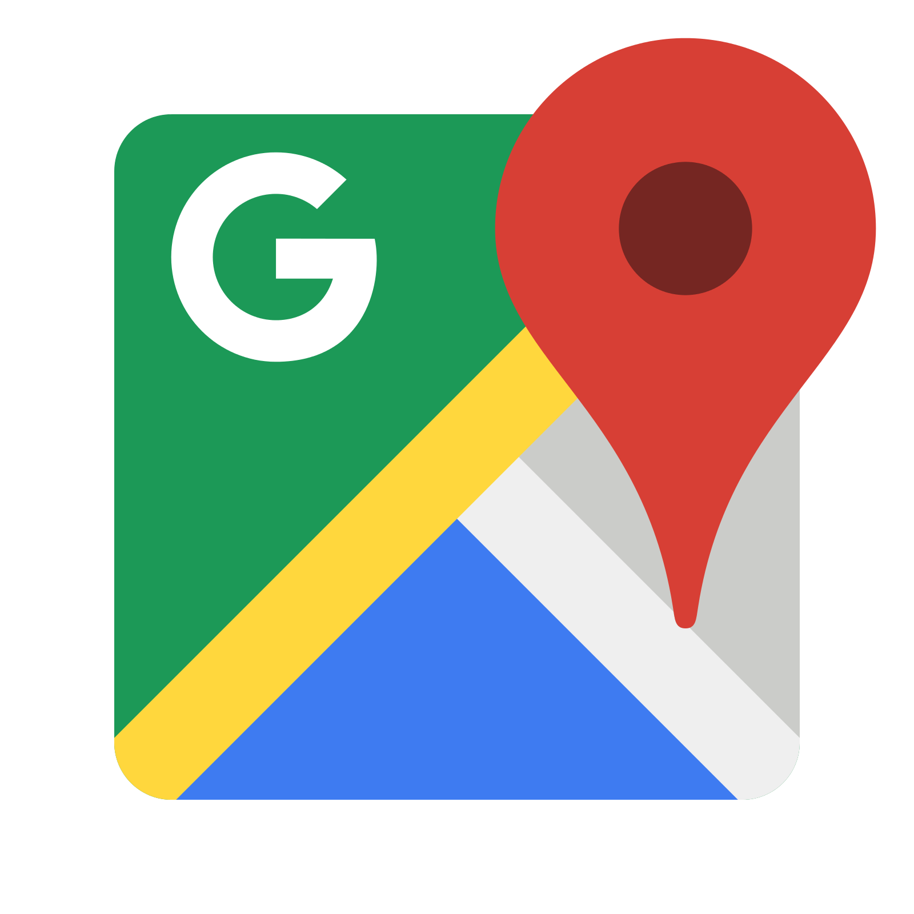

#  Google Maps Services

## About
This skill uses Google Maps Services for the following Google Maps APIs:

 - [Directions API]
 - [Distance Matrix API]
 - [Elevation API]
 - [Geocoding API]
 - [Geolocation API]
 - [Time Zone API]
 - [Roads API]
 - [Places API]

Keep in mind that the same [terms and conditions](https://developers.google.com/maps/terms) apply
to usage of the APIs when they're accessed through this skill.

### API keys

Each Google Maps Web Service request requires an API key or client ID. API keys
are freely available with a Google Account at
https://developers.google.com/console. The type of API key you need is a
**Server key**.

To get an API key:

 1. Visit https://developers.google.com/console and log in with
    a Google Account.
 1. Select one of your existing projects, or create a new project.
 1. Enable the API(s) you want to use. The Python Client for Google Maps Services
    accesses the following APIs:
    * Directions API
    * Distance Matrix API
    * Elevation API
    * Geocoding API
    * Geolocation API
    * Places API
    * Roads API
    * Time Zone API
 1. Create a new **Server key**.
 1. If you'd like to restrict requests to a specific IP address, do so now.

For guided help, follow the instructions for the [Directions API][directions-key].
You only need one API key, but remember to enable all the APIs you need.
For even more information, see the guide to [API keys][apikey].

**Important:** This key should be kept secret on your server.

## Examples
 - "how long does it take from lergravsvej 14 to lyngbyvej 2 by driving"

## Credits
andlo

